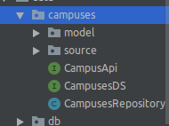
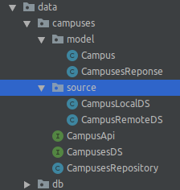
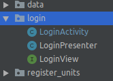

# TimetablerApp
This is part of my final research project for my degree course in Computer
Science.
## Overview
This is an Android application represents a two-part for a software 
system, TimetablerApp represents the client side of the
client-server architecture. This application allows users, ie lecturers,
students and administrators to view and register for units and view the
timetable once it is available.

## Scope
As of version 1.0.0 the app reflects requirements and models of Catholic
University of Eastern Africa. Future updates will be shown here.

## Features
## Software Architecture
The applicable software architecture for data communication is the
Server-Client Architectural pattern. It allows smooth transmission of
data from the client side to the server and from the server to the
client without any loss of data. If data integrity is compromised the
client relays another request to the client.

The Model-View-Presenter architectural pattern is used to allow an even
distribution of data throughout the application’s lifecycle and
encourage modularization. The application’s structure is ordered ideally
to avoid confusion and mistakes during software development.

### Android Application Client
The architectural patterns used in the android application is referred
to as the Model-View-Presenter architectural pattern (MVP). MVP
separates the representation of information during user interaction with
the application.

The Model represents the application’s access to data. The object and 
data storage description. Each individual module is made up of three components.

The model - that holds Plain Old Java Objects (POJOs), that describe 
the attributes of the model in question. For example in the image below 
Campus and CampusResponse are models of a campus.

The last component of the model is the repository. The repository 
represents an interface between the data model and the presenter. 
It delegates task to the local and remote data source access objects as 
requested by the presenter and relays the relevant data back to the 
presenter for processing.

The Source - these are components that interact with the model directly. 
The source module contains an object that accesses local data source, 
that is the local databases and storage utilities, and another object 
that accesses remote data sources. 
In this case CampusLocalDS(CampusLocalDataSource) and CampusRemoteDS.

The View - displays information to the user in user friendly manner to
convey the desired information to the user. The view provides an
interface that the user interacts with. Most of the View components are
represented as illustrated below. A view is usually designed using an
activity or fragment. As illustrated below, LoginActivity is used the
create a login screen to allow the user to key in their credentials and
log into the system. User interface description will be outlined below.

The Presenter represents the logic of the application, all the business
logic of the application goes here. The presenter also acts as an
interface between the application’s data model and the view parts of the
MVP structure.

This is the basic structure of the application source code.
